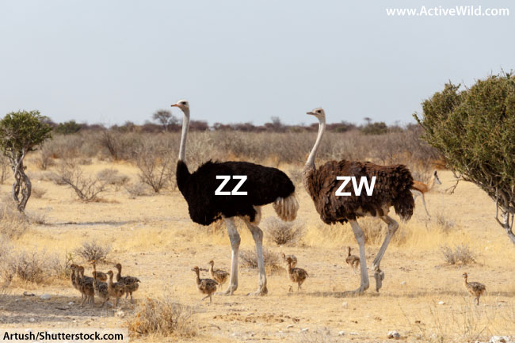

# The evolutionary maintenance of ancient recombining sex chromosomes in ostrich  

Homa Papoli Yazdi1, Colin Olito1, Takeshi Kawakami, Per Unneberg, Mads F. Schou, Schalk W. P. Cloete, Bengt Hansson and Charlie K. Cornwallis

1 These authors contributed equally to this work.

### Abstract

Sex chromosomes have evolved repeatedly across the tree of life and are often characterized by extreme size dimorphism caused by the genetic degeneration of the sex-limited chromosome (e.g. the W chromosome of birds and Y chromosomes of mammals). In some cases, however, ancient sex-limited chromosomes have escaped degeneration. In this paper, we address how the sex chromosomes of ostriches (Struthio camelus) have avoided genetic degradation (the W remains 65% the size of the Z chromosome), despite being more than 100 million years old. Using genome-wide resequencing data, we show that the population scaled recombination rate of the pseduoautosomal region (PAR) is higher than similar sized autosomal regions and is correlated with female recombination rate on the PAR, highlighting the impact of recombination rate in the heterogametic sex on the evolutionary dynamics of PAR sequences. As a result, we detected no genetic linkage between the sex-linked region (SLR) and the PAR across the PAR boundary, possible due to a higher female recombination rate at the PAR boundary. Levels of genetic variation across the PAR (π = 0.0016) were similar to the autosomal average and were explained by local recombination rates, GC content and, to a lesser extent, gene density. In contrast, the genetic diversity of the sex-linked region (π = 0.001) was significantly lower than the PAR, consistent with recombination cessation. Finally, we found that allele frequencies between males and females were divergent in some regions of the PAR, but coalescent simulations showed this was broadly consistent with neutral genetic processes. Our results indicate that the large and ancient ostrich PAR has similar population genomic characteristics to autosomal sequences and that W degeneration appears to have been slowed by recombination in the female PAR reducing the accumulation of sexually antagonistic alleles.

### Instructions

### Repository structure and contents

### Contact and bug reporting

### License information

